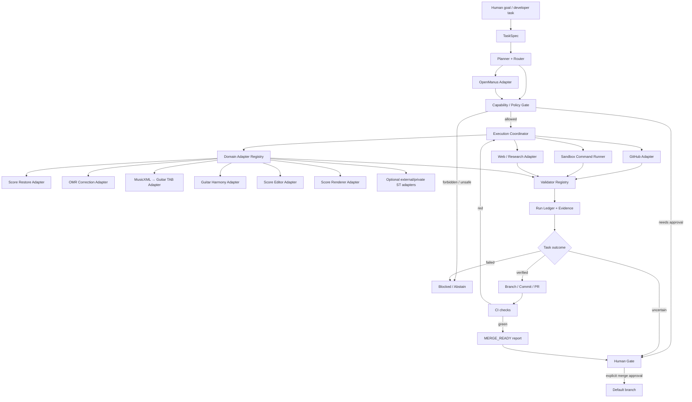
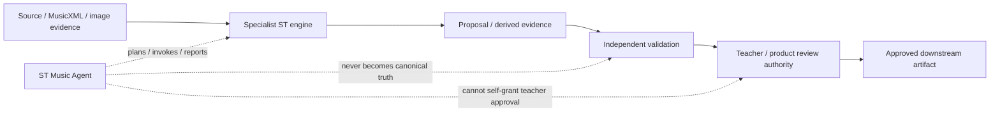

# ST Music Agent Lab — Architecture v0

Status: architecture baseline / no production authority  
Date: 2026-09-10

## Purpose

ST Music Agent Lab is an isolated research and engineering control plane for coordinating AI-agent work across ST music software. It does not become a score authority, OMR authority, teacher authority, renderer authority, model-training authority, or production deployment authority.

OpenManus is treated as a replaceable external agent-framework adapter rather than the architecture itself. ST-owned task, policy, validation, audit, and authority contracts remain outside the OpenManus dependency so the project can replace or upgrade the agent framework without changing core governance.

## System map



## Architectural layers

### 1. Task contract

Every run starts from a typed `TaskSpec`, not a free-form permission grant. The task contract should define:

- target repository and allowed branch scope;
- requested objective and acceptance criteria;
- allowed tools/capabilities;
- mutation budget and file/path boundaries;
- test commands or validator requirements;
- stop conditions;
- whether the run is read-only, proposal-only, branch-write, or PR-capable.

### 2. Planner / router

The planner converts the task into bounded steps and chooses tools or specialist adapters. Planning is advisory. A planned action has no authority until the capability/policy gate admits it.

OpenManus initially supplies general agent planning/tool-use behavior. Its internal memory, prompts, agent state, and tool selection must not become ST canonical truth.

### 3. Capability / policy gate

This is the primary safety boundary. It is ST-owned and framework-independent.

The gate evaluates every side-effecting action against the task contract and runtime allowlist. Examples:

- repository read: normally allowed;
- sandbox test execution: allowed when bounded;
- branch write: allowed only on an explicitly admitted non-default branch;
- pull request creation: allowed when configured acceptance checks are satisfied or the PR is explicitly marked as review-required;
- merge/default-branch write: human gate by default;
- CI weakening, secret exposure, force-push, evidence fabrication, production activation: forbidden.

### 4. Execution coordinator

The coordinator runs approved steps, records tool results, applies budgets and stop conditions, and prevents unbounded retry loops. A failed action returns structured evidence to the planner; it does not silently widen authority.

### 5. Tool adapters

Tool access is separated behind ST-owned interfaces:

- `GitHubAdapter`: repository metadata, files, branches, commits, pull requests, CI/status evidence;
- `SandboxRunner`: bounded shell/Python/Node/test execution in an isolated workspace;
- `ResearchAdapter`: web/document research as non-authoritative evidence;
- `ArtifactAdapter`: local generated reports and sanitized run artifacts;
- future MCP tools only through explicit allowlisting.

API keys, tokens, private repository configuration, production credentials, model-provider secrets, and student/user data must never be committed.

### 6. Domain adapter registry

The agent does not reimplement specialist engines. It calls them through adapters while preserving each engine's authority boundary.

Initial public integration targets:

| Adapter | Role | Authority retained by target |
|---|---|---|
| ST Score Restore | visual restoration / preservation evidence | immutable source + restoration safety |
| ST OMR Correction | bounded OMR anomaly/correction proposals | source MusicXML + independent revalidation |
| MusicXML → Guitar TAB | deterministic playable guitar projection | canonical TAB contract / physical solver |
| ST Guitar Harmonic Engine | symbolic harmony analysis/evidence | deterministic harmonic contracts |
| ST Score Editor Core | bounded semantic score editing | canonical score/editor session |
| ST Score Rendering Layer | notation presentation | presentation only; never musical authority |

Private or product repositories may be attached later through local allowlisted configuration without hard-coding private repository names or credentials into this public lab.

### 7. Validator registry

The agent may propose or execute work, but validators determine whether evidence satisfies the task contract. Validation is separate from the model/agent that produced the change.

Validator classes should include:

- unit/integration/regression test result;
- static/type/lint/build result;
- schema/contract compatibility;
- immutable-source and provenance checks where applicable;
- diff-risk and forbidden-path checks;
- deterministic rerun checks where applicable;
- domain-specific validators supplied by the target repository;
- CI status and required-check verification.

A validator failure must not be converted into success by an LLM explanation.

## Music authority boundary



The agent may coordinate these steps but must not collapse source evidence, automatic output, teacher-corrected revisions, approval, publication, or deployment into one authority state.

## GitHub development flow

```text
TaskSpec
  -> read repository / architecture
  -> create isolated task branch
  -> bounded change
  -> local validators
  -> commit
  -> pull request
  -> CI
      -> red: diagnose -> bounded fix -> revalidate
      -> green: MERGE_READY
  -> human merge gate by default
```

Direct default-branch writes and force-push are outside the v0 authority model.

## Run ledger

Each agent run should produce a machine-readable summary containing at minimum:

- run id and timestamp;
- task id / objective;
- target repo + base SHA + working branch;
- agent-framework identity/version;
- LLM/provider identity where policy permits recording it;
- capabilities granted;
- files changed;
- tests/validators executed and results;
- commits/PRs created;
- unresolved findings;
- final state: `SUCCEEDED`, `NEEDS_REVIEW`, `BLOCKED`, or `ABSTAINED`.

The run ledger records actions and evidence; it is not a hidden chain-of-thought log.

## Self-improvement boundary

Future self-improvement is permitted only as benchmarked proposal work:

```text
fixed benchmark/task corpus
  -> current agent baseline
  -> proposed prompt/tool/router/code change
  -> isolated candidate branch
  -> same benchmark + regression suite
  -> compare quality / cost / failure rate
  -> PR only if evidence improves without safety regression
  -> human merge gate
```

The agent must not rewrite its validators, benchmark labels, authority policy, or acceptance thresholds merely to make its own candidate pass.

## Deployment boundary

Version 0 is a development lab. It does not authorize:

- production service deployment;
- production credentials;
- automatic merge;
- automatic release/publication;
- live student/user data access;
- teacher approval on behalf of a person;
- training-data admission or model promotion;
- unrestricted cross-repository mutation.

Those require separate explicit architecture and security gates.
